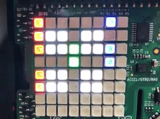

# Raspberry Pi Binary Clock in C

This program creates a binary display of a real-time clock, which was displayed visually on a Raspberry Pi Model 3 B+ and Sense Hat.

- Trevor Foresta 
tforesta@udel.edu
702353352

- Jason He
jasonhe@udel.edu
702476359

- Nick Costley
ncostey@udel.edu
702468103
